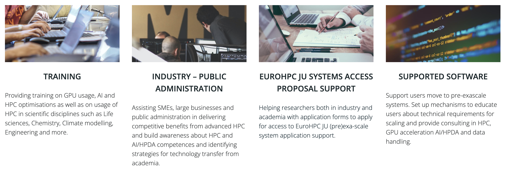

```{instructor-note}
   - 10 min teaching
   - 5 min discussion
```   

# ENCCS Training

[ENCCS](https://enccs.se/) (EuroCC National Competence Center Sweden) is one of 33 
nodes of the [EuroCC project](https://www.eurocc-access.eu/), which is funded by the 
European High-Performance Computing Joint Undertaking (EuroHPC-JU). As an NCC, we act as the central point of contact for HPC and related technologies in Sweden.
Our mission is to empower Swedish industry, academia and the public sector to leverage HPC, AI, and HPDA efficiently and effectively. 



Training is one of the main pillars of ENCCS' activities. We have developed a large amount of 
public and open source [lesson material](https://enccs.se/lessons/) and have taught over 45 
online workshops since September 2020. 
Our training philosophy and methods are to a large extent derived from two well established 
educational initiatives: [CodeRefinery](https://coderefinery.org/) and [The Carpentries](https://carpentries.org/). The material presented here covers both pedagogical ideas and practical 
aspects which underpin the development of lesson material, organisation of online or in-person 
workshops and the teaching itself.


---

## The Carpentries
 
[The Carpentries](https://carpentries.org/) is an international project that comprises [Software Carpentry](https://software-carpentry.org/) and [Data Carpentry](https://datacarpentry.org/), 
communities of instructors, trainers, maintainers, helpers, and supporters who share a mission to 
teach foundational computational and data science skills to researchers. The Carpentries teach 
foundational coding and data science skills to researchers worldwide.

### Carpentry instructor training

ENCCS instructors are encouraced to complete the
[Carpentry instructor training workshop](https://carpentries.github.io/instructor-training/), which
[anyone can apply for](https://carpentries.org/become-instructor/).

This instructor training lesson presents several concepts and methods from the Carpentries 
approach to teaching and highlight parts that are most important for teaching ENCCS style lessons.
We encourage you to further study the Carpentry lesson later and to sign up for a 2-day Carpentry
intructor training workshop.

### Carpentries audience

The Carpentries aims to teach computational **competence** to learners through an applied approach, avoiding the theoretical and general in favor of the practical and specific.
**Learners do not need to have any prior experience in programming.**  One major goal of a Carpentry workshop is to raise awareness on the tools researchers can learn/use to speed up their research.

By showing learners how to solve specific problems with specific tools and providing hands-on practice, learners develops confidence for future learning.

> ## Novices
> Carpentry learners can be qualified as **novices**: they do not know what they need to learn yet. A typical example is the usage of version control: the Carpentry `git` lesson aims to give a very high level conceptual overview of Git but it does not explain how it can be used in research projects.
{: .callout}

---

## CodeRefinery

[CodeRefinery](https://coderefinery.org/) is a [Nordic e-Infrastructure Collaboration (NeIC)](https://neic.no/) project that started in October 2016.
The main goals of CodeRefinery are:
- Develop and maintain training material on software best practices for researchers that already write code. The CodeRefinery lessons address all academic disciplines and try to be as programming language-independent as possible.
- Provide a [code repository hosting service](https://coderefinery.org/repository/) that is open and free for all researchers based in universities and research institutes from Nordic countries.
- Provide training opportunities in the Nordics using Carpentries and CodeRefinery training materials.
- Articulate and implement the CodeRefinery sustainability plan.

### CodeRefinery audience

CodeRefinery workshops differ from Carpentry workshops as the audience is assumed to already write code and scripts and we aim at teaching them **best software practices**.

CodeRefinery learners usually do not have a good overview of **best software practices** but are aware of the need to learn them. Very often, they know the tools (Git, Jupyter, etc.) we are teaching but have difficulties to make the best use of them in their software development workflow.

> ## Competent practitioners
> CodeRefinery learners can be qualified as **competent practitioners** because they already have an understanding of their needs.
> *Novices* and *competent practitioners* will be more clearly defined in a {doc}`later section <learners>`.
{: .callout}

### ENCCS audience

Similarly to CodeRefinery, ENCCS targets **competent practitioners**: participants are assumed 
to know what their needs are. Typically, their needs are to learn a technique or method to adapt 
their code to HPC, to learn novel programming languages or frameworks, or to deepen their knowledge 
of machine learning methods.

---

## Teaching philosophy

ENCCS, CodeRefinery and The Carpentries all teach computational competences to learners through 
an applied approach founded on research-based teaching principles.
Usually, we avoid the theoretical and general in favor of the practical and specific. By 
showing learners how to solve specific problems with specific tools and providing hands-on 
practice, we develop learners’ confidence and empower them to start applying new knowledge 
immediately.

- Learners need to practice what they are learning in real time and get **feedback** on what they are doing. That is why the teaching approach relies on **live coding**.
- Learners best learn in a respectful and motivating classroom environment, so it's important to use a **Code of Conduct** and avoid certain demotivating language. 
- Learners are encouraged to **help each other and collaborate** during workshops as this improves their confidence and reinforces concepts taught.


### Specific aspects 

- Teaching material (lessons) available in advance and not PDF slides.
- Lessons suitable also for self study.
- Interactive, hands-on teaching: presentations and type-alongs interleaved with exercises.
- Shared collaborative workshop document for questions, answers, information etc.
- Clearly defined teaching roles (instructor, host, answering questions in shared document, ...)
- Recruiting volunteer helpers and instructors.
- Frequently asking for and encouraging feedback.
- Emphasis on code of conduct and inclusivity.
- Thoughtful screen sharing and shell sharing.
- Lessons developed from well defined learning objectives.
- Using a standard lesson template.
- Collaborative lesson development and peer review on GitHub.
- Lessons are open source instead of private.

`````{challenge} How common are these practices?

How many of the teaching features above do you use in your own teaching? 

The instructor can copy-paste the list below to the shared workshop document and conduct a poll. 

````{solution} Poll
```
Which of these practices do you use in your teaching? Vote by adding "o".

- Teaching material (lessons) available in advance and not PDF slides: o
- Lessons suitable also for self study: o
- Interactive, hands-on teaching: presentations and type-alongs interleaved with exercises: o
- Shared collaborative workshop document for questions, answers, information etc: o
- Clearly defined teaching roles (instructor, host, answering questions in shared document, ...): o
- Recruiting volunteer helpers and instructors: o
- Frequently asking for and encouraging feedback: o
- Emphasis on code of conduct and inclusivity: o
- Thoughtful screen sharing and shell sharing: o
- Lessons developed from well defined learning objectives: o
- Using a standard lesson template: o
- Collaborative lesson development and peer review on GitHub: o
- Lessons are open source instead of private: o
```
````
`````

## See also

- [Active Learning Leads to Higher Grades and Fewer Failing Students in Science, Math, and Engineering](https://www.wired.com/2014/05/empzeal-active-learning/)
