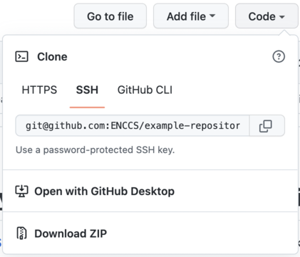
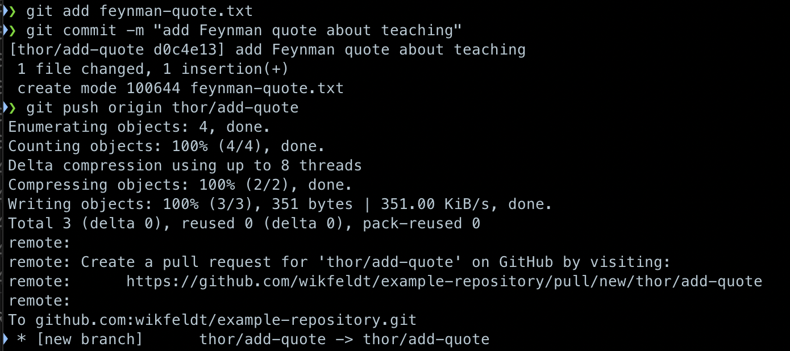
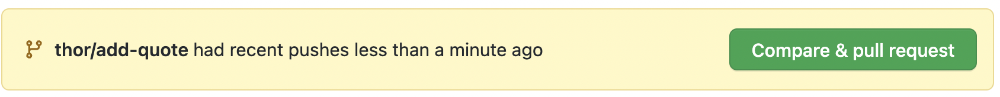
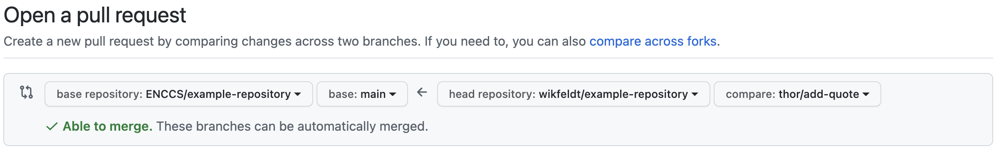
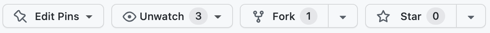

```{instructor-note}
   - 15 min teaching
   - 30 min exercises   
```

# Collaborative Lesson Development

```{questions}
- What tools and methods can be used to collaboratively develop training material?
```

```{objectives}
- Explain how the Sphinx lesson template works.
- Learn collaborative workflows for developing lessons.
```

This episode focuses on **organisational** and **technical aspects**
of collaborative lesson development.

```{discussion}
This session is about **collaborative** lesson development. What advantages do
you see in developing lessons collaboratively and sharing lessons (making
material accessible)?  What difficulties are there?
```

---

## Lesson templates for static sites

Why static sites?
- Decentralized (in terms of organization/namespace)
- Forkable
- Anybody can suggest changes

- [Sphinx](https://www.sphinx-doc.org)-based
  - Example: this lesson
  - Starting point: [sphinx-lesson](https://github.com/coderefinery/sphinx-lesson)
  - [Documentation](https://coderefinery.github.io/sphinx-lesson/)
- Templates can be freely re-used


```{challenge} Explore a Sphinx lesson (10 min)
- Open [this very lesson in GitHub](https://github.com/ENCCS/instructor-training) 
  (it uses the same format as typical CodeRefinery and ENCCS lessons) (you can also click 
  on the "Edit on GitHub" link in the top-right corner).
- Browse the files and understand the general idea. Check out at least these and use HackMD to 
  record their functions:
  - .github/workflows/sphinx.yml
  - content/conf.py
  - content/index.rst
  - content/lesson-development.md
- If you want, try to make a pull request to this lesson. It doesn’t have to have any significant 
  content, it can be a pure test pull request.
```

```{challenge} Create your own lesson (10 min)
Use the [sphinx-lesson-template](https://github.com/ENCCS/sphinx-lesson-template) to create a new 
lesson of your choice. 
- Click "Use this template" and choose a name and where you want to create it. Make it Public and 
  don't select "Include all branches"
- After the new repository is created, wait a couple of minutes before the `gh-pages` branch 
  is created by the automatic GitHub Action. Then go to "Settings" and click "Pages" from the left 
  menu. There select `gh-pages` under the Branch section. Don't change from "/ (root)".
- After a few minutes, there should be a new box at the top of the "pages" page showing 
  "Your site is live at https://<some-username>.github.io/<lesson-name>". Click the link 
  to see your empty lesson!
- If you want to try out different functionality, go to 
  https://coderefinery.github.io/sphinx-lesson/ and have a look at the episodes under "Basic 
  Syntax". You can create new episodes in Markdown, RST or a Jupyter notebook and include them 
  in `index.rst` under "The lesson" (make sure to use consistent indentation)
```

---

## Contributing to existing lessons

Our lessons are **collaboratively developed** and some are created by many
people. We encourage everyone to contribute to the lessons.

Lessons should be reviewed often - essentially, before each workshop by
the instructor of that workshop.  This can be a quick review, looking
at issues and fixing easy things, or more thorough.

Every so often, there is an extensive
hackathon period of fully revising a lesson and making major improvements.

CodeRefinery has a [lesson-review](https://coderefinery.github.io/manuals/lesson-review/) 
checklist to guide the review process.

---

## Collaborative workflows

There are two main ways to collaborate on lesson (or code) development 
on a repository-hosting website like [GitHub](https://github.com/), 
[GitLab](https://about.gitlab.com/) or [Bitbucket](https://bitbucket.org/).

**Centralized workflow**


- Typically all developers have both read and write permissions (double-headed arrows).
- Suited for cases where **all developers are in the same group or organization or project**.
- **Everybody who wants to contribute needs write access**.
- Good idea to write-protect the main branch (typically master or main).

**Forking workflow**


In the **forking layout**, again we call one repository the “central” repository but people push to forks (their own copies of the repository on GitHub/GitLab/Bitbucket).

- **Anybody can contribute without asking for permission** (to public projects).
- Maintainer still has **full control over what is merged**.
- There is now **more than one remote** to work with.

`````{challenge} Practice collaborative workflow (10 min)

Here we will practice the forking workflow. **NOTE**: You will need a 
[GitHub account](https://github.com/signup) to perform this exercise.

````{tabs}
```{tab} Centralised workflow

- The maintainer of the repository will first need to add you as contributors with write permissions.
- Navigate to [this example repository on GitHub](https://github.com/ENCCS/example-repository).
- Clone the repository to your computer by clicking the Code button
  and copy-paste the name of the remote. 
  Choose SSH if you have uploaded SSH keys to GitHub, otherwise go for HTTPS.
  Then go to a terminal on your computer, and type `git clone <copy-pasted-remote>`.  
  
- Best practice: create a new branch in your local repository: `git checkout -b <name/feature>` 
  (replace "name" with your name, and "feature" with a descriptor of your intended change).
- Now add a new plain-text file to the repository. You can create it with a terminal editor 
  (nano, emacs, vim) or a simple text editor. In the file, add either a famous quote, a cooking 
  recipe, a poem or something else that you like. 
- After the file is created, *stage* it with `git add <filename>`.
- After staging, *commit* the file with `git commit -m <some descriptive commit message>`.
- Now push your commit to your fork: `git push origin <name/feature>`
- In the output of the push command you will see a URL for creating a **pull request**. 
  Copy-paste it to a web browser. 
    
  You can also just go to the page of the example repository - 
  there should be a new menu at the top inviting you to create a pull request.
  
- On the "Open a pull request" page, make sure that you are sending the pull request from 
  your feature branch to the main branch
  
- Finally, edit the title of the pull request and add a comment (optional), and then 
  click the green "Create pull request" button.
- You have now created a pull request and a collaborator can review your change, provide feedback 
  if needed (e.g. to ask for changes), and then merge it into the main branch!
```

```{tab} Forking workflow

- Navigate to [this example repository on GitHub](https://github.com/ENCCS/example-repository)
- Fork the repository to your own GitHub account by clicking the Fork button at the top.
  
  
- After the fork has been created, clone the repository to your computer by clicking the Code button
  and copy-paste the name of the remote. 
  Choose SSH if you have uploaded SSH keys to GitHub, otherwise go for HTTPS.
  Then go to a terminal on your computer, and type `git clone <copy-pasted-remote>`.  
  

- Best practice: create a new branch in your local repository: `git checkout -b <name/feature>` 
  (replace "name" with your name, and "feature" with a descriptor of your intended change).
- Now add a new plain-text file to the repository. You can create it with a terminal editor 
  (nano, emacs, vim) or a simple text editor. In the file, add either a famous quote, a cooking 
  recipe, a poem or something else that you like. 
- After the file is created, *stage* it with `git add <filename>`.
- After staging, *commit* the file with `git commit -m <some descriptive commit message>`.
- Now push your commit to your fork: `git push origin <name/feature>`
- In the output of the push command you will see a URL for creating a **pull request**. 
  Copy-paste it to a web browser. 
    
  You can also just go to the page of your forked repository - 
  there should be a new menu at the top inviting you to create a pull request.
  
- On the "Open a pull request" page, make sure that you are sending the pull request from 
  your feature branch on your forked repository to the main branch of the parent repository
  
- Finally, edit the title of the pull request and add a comment (optional), and then 
  click the green "Create pull request" button.
- You have now created a pull request and a maintainer of the central repository 
  can review your change, provide feedback 
  if needed (e.g. to ask for changes), and then merge it into the main branch!

Bonus question: Why is it best practice to create a "feature" branch in your local repository?  
```
````
`````

## Code reviews

```{callout} Why code review?
In collaborative software development, it is standard practice to review each other's 
code changes. This serves multiple purposes:
- Others in the team learn about your changes.
- An extra pair of eyes are useful to catch bugs or suggest improvements
- It's possible (and common) to enable *automated testing* so that each pull request is tested 
  automatically in the cloud so that the reviewer can see whether a pull request passes all 
  unit tests.

There's no reason not to apply these practices to collaborative lesson development!
```

---

## Recommendations and lessons learned

- Convert feedback about lessons and suggestions for improvements into *issues*
  so that these don't get lost.
- Make your lesson citable: get a DOI.
- Credit contributors (not only Git commits).
- Instructor guide is essential for new instructors.
- Lesson changes should be accompanied with instructor guide changes (it's like
  a documentation for the lesson material).
- Apply and validate backwards lesson design again and again.
- Make it possible to try out new ideas (by making the lesson branch-able).
- Before making larger changes, talk with somebody and discuss these changes.
- For substantial changes we recommend to first open an issue and describe your
  idea and collect feedback before you start with an extensive rewrite.
- For things still under construction, open a draft pull request to collect
  feedback and to signal to others what you are working on.

